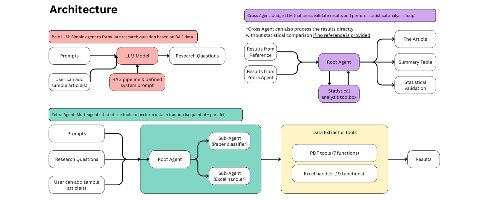

# 🦓 ZebraX: AI-Powered Literature Review & Data Extraction

ZebraX is an intelligent multi-agent system that automates systematic literature reviews and research data extraction using Google's Agent Development Kit (ADK).

## 🎬 Demo

[](https://youtu.be/4t44i6N9z4s)

## 🎯 Problem Statement

Literature review is a monumental task for students and researchers trying to understand the current state of knowledge in their field. The process typically involves:

- Reading dozens to hundreds of research papers
- Manually extracting data points into spreadsheets
- Classifying papers based on various criteria
- Cross-validating extracted information

**ZebraX tackles this challenge** by automating paper reading, answering research questions, and extracting structured data—saving researchers countless hours of manual work.

## 🤖 Why Agents?

With AI agents, we gain the flexibility to:
- Add specialized tools for different extraction tasks
- Orchestrate complex workflows with multiple steps
- Process documents in parallel for efficiency
- Maintain context across multi-step operations

## 🏗️ Architecture



ZebraX consists of three specialized agents working together:

### 1. 🦓 Zebra Agent (Multi-Agent Data Extractor)

The main workhorse of ZebraX - a multi-agent system for parallel and sequential data extraction from research materials.

**Model:** Google Gemini 2.5 Flash (optimized for function calling)

**Sub-Agents:**
| Sub-Agent | Purpose |
|-----------|---------|
| **Router** | Intelligently routes requests to appropriate sub-agents |
| **Paper Classifier** | Reads PDFs and classifies papers based on user-defined criteria |
| **Excel Handler** | Manages all Excel operations (read, write, update, delete) |
| **Summarizer** | Provides final summaries and reports to users |

**Tools Available:**
- **PDF Tools:**
  - `read_pdf_text` - Extract text from PDF documents
  - `batch_read_pdfs` - Process multiple PDFs in parallel
  - `get_pdf_info` - Get PDF metadata
  - `extract_pdf_images` - Extract images from PDFs

- **Excel Tools:**
  - `read_excel_data` / `excel_to_json` - Read Excel files
  - `update_excel_row` / `batch_update_cells` - Update data
  - `add_column_to_excel` / `delete_excel_column` - Column operations
  - `find_row_by_title` / `update_classification_by_title` - Smart matching
  - `transform_column` - Bulk transformations

**Process Flow:**
```
Research Query + PDFs + Excel Template
         ↓
    [Router Agent]
         ↓
    ┌────┴────┐
    ↓         ↓
[Paper      [Excel
Classifier]  Handler]
    ↓         ↓
    └────┬────┘
         ↓
   [Summarizer]
         ↓
  Structured Results
```

### 2. 🔔 Belo Agent (Research Question Generator)

A lightweight agent that helps researchers formulate research questions when they don't have predefined ones.

**Model:** Google Gemini 2.5 Flash (fast inference)

**Capabilities:**
- Formulates up to 5 research questions per request
- Uses Google Search to find current trends and research gaps
- Provides warm, encouraging guidance like a research advisor

**Use Case:** When starting a new systematic review without clear research questions

### 3. ✝️ Cross Agent (Statistical Validator)

A validation agent for cross-checking extracted results and performing statistical analysis.

**Model:** Google Gemini 2.5 Flash (advanced reasoning)

**Sub-Agents:**
| Sub-Agent | Purpose |
|-----------|---------|
| **Router** | Routes comparison requests |
| **Cross Comparison** | Performs table comparisons and statistics |
| **Summarizer** | Generates validation reports |

**Statistical Tools:**
- `compare_tables_overview` - High-level table comparison
- `compare_column_values` - Column-by-column analysis
- `calculate_cohens_kappa` - Inter-rater reliability
- `calculate_all_agreement_metrics` - Comprehensive metrics
- `get_disagreement_report` - Detailed difference reports
- `full_statistical_comparison` - Complete analysis suite

## 🔄 Workflow


### Typical Use Case

1. **Setup**: Prepare an Excel template with columns for data extraction
2. **Input**: Provide PDF research papers and research questions
3. **Process**: Zebra Agent reads papers and extracts data into Excel
4. **Validate**: Cross Agent compares results with ground truth (if available)
5. **Output**: Get structured data with validation statistics

## 🛠️ Technology Stack

| Component | Technology |
|-----------|------------|
| **Framework** | Google Agent Development Kit (ADK) |
| **LLM Models** | Google Gemini 2.5 Flash |
| **PDF Processing** | PyMuPDF (fitz), pytesseract, Pillow |
| **Data Handling** | pandas, openpyxl |
| **Statistical Analysis** | numpy, scipy |

## 📦 Installation

```bash
# Clone the repository
git clone https://github.com/im-sanka/ZebraX.git
cd ZebraX

# Install dependencies
pip install -r requirements.txt

# Set up environment variables
# Create a .env file with your Google API key
echo "GOOGLE_API_KEY=your_api_key_here" > .env
```

## 🚀 Usage

### Running with ADK Web Interface

```bash
# Start the ADK web interface for Zebra agent
adk web agents/zebra

# Or run Belo agent
adk web agents/belo

# Or run Cross agent
adk web agents/cross
```

### Example Prompts for Zebra Agent

```
# Classify papers
"Read all PDFs in /path/to/papers and classify them based on whether 
they use machine learning. Update the results in /path/to/data.xlsx"

# Extract data
"Extract the sample size, methodology, and key findings from the papers 
in /path/to/articles and add them to my Excel file"

# Update Excel
"Add a new column called 'Included' to my Excel file at /path/to/data.xlsx"
```

### Example Prompts for Belo Agent

```
"I want to study the impact of synthetic biology on sustainable agriculture"
"Help me formulate research questions about AI in healthcare"
```

### Example Prompts for Cross Agent

```
"Compare the tables at /path/to/ground_truth.xlsx and /path/to/extracted.xlsx"
"Calculate Cohen's Kappa for the 'Classification' column between these two files"
```

## 📁 Project Structure

```
ZebraX/
├── agents/
│   ├── zebra/           # Main data extraction agent
│   │   ├── agent.py     # Orchestrator (BaseAgent)
│   │   └── subagents/
│   │       ├── paper_classifier.py
│   │       ├── excel_handler.py
│   │       ├── summarizer.py
│   │       ├── tools/
│   │       │   ├── pdf_tools.py
│   │       │   └── excel_tools.py
│   │       └── instructions/
│   ├── belo/            # Research question generator
│   │   └── agent.py
│   └── cross/           # Statistical validator
│       ├── agent.py
│       └── subagents/
│           ├── cross_comparison.py
│           ├── summarizer.py
│           └── tools/
│               └── cross_tools.py
├── data/                # Sample data files
├── test/                # Test articles
├── images/              # Architecture diagrams
└── requirements.txt
```

## 🎯 Future Improvements

- [ ] Enhanced Belo and Cross orchestration integration
- [ ] Support for more document formats (Word, HTML)
- [ ] Batch processing optimization for large paper sets
- [ ] Interactive web dashboard for monitoring extraction progress
- [ ] Export to multiple formats (BibTeX, RIS, CSV)

## 👥 Authors

- [**im-sanka**](https://github.com/im-sanka)
- [**rahmanuh**](https://github.com/rahmanuh)

## 📄 License

This project was created for the Google ADK Hackathon 2025.

---

*Built with ❤️ using Google Agent Development Kit (ADK) and Gemini*
